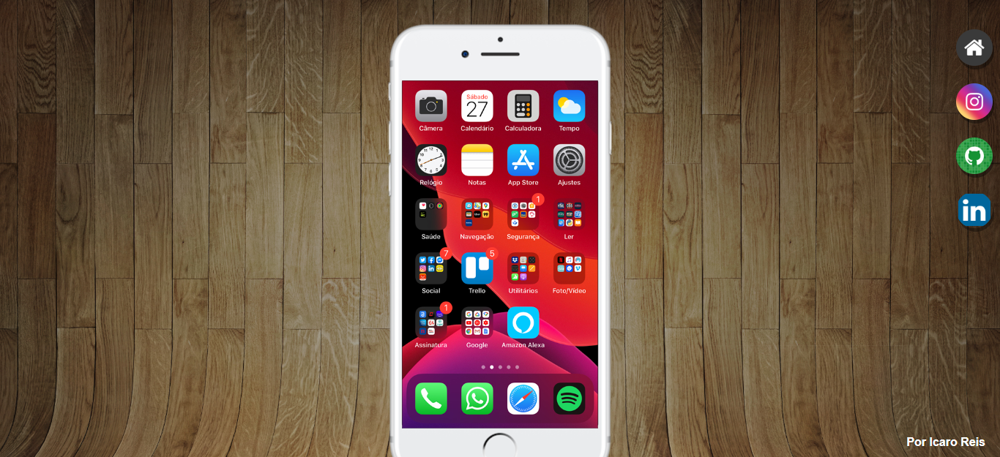

# projeto redes-socias

Site Criado por mim [Icaro reis](https://www.linkedin.com/in/%C3%ADcaro-reis-970a1221a/)
focado em aprimorar meus conhecimentos em Front-end e o uso de iframes

 
 [🔗Clique aqui para acessar o projeto](https://icaropaixao.github.io/projeto-redes-sociais/)

 ## Tecnologias 🤖 :

 - HTML

 - CSS

 - GITHUB

 # 💻 Contato 

 @icaroreis1982@gmail.com
